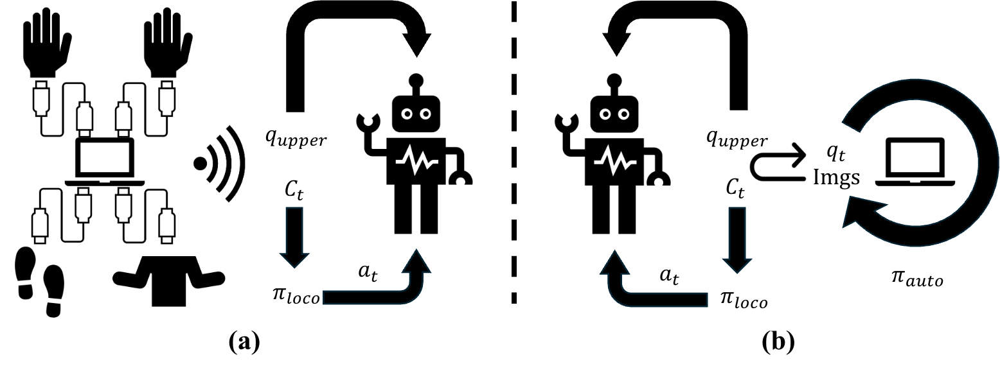

<br>
<p align="center">
<h1 align="center"><strong>HOMIE: Humanoid Loco-Manipulation with Isomorphic Exoskeleton Cockpit (Deployment)</strong></h1>
  <p align="center">
    <a href='https://www.qingweiben.com' target='_blank'>Qingwei Ben*</a>, <a href='https://trap-1.github.io/' target='_blank'>Feiyu Jia*</a>, <a href='https://scholar.google.com/citations?user=kYrUfMoAAAAJ&hl=zh-CN' target='_blank'>Jia Zeng</a>, <a href='https://jtdong.com/' target='_blank'>Junting Dong</a>, <a href='https://dahua.site/' target='_blank'>Dahua Lin</a>, <a href='https://oceanpang.github.io/' target='_blank'>Jiangmiao Pang</a>
    <br>
    * Equal Controlbution
    <br>
    Shanghai Artificial Intelligence Laboratory & The Chinese University of Hong Kong
    <br>
  </p>
</p>

<div id="top" align="center">

[](https://arxiv.org/abs/2502.13013)
[](https://homietele.github.io/)



</div>

## 📋 Contents

- [🏠 Description](#-description)
- [📚 Usage](#-use)
- [🔗 Citation](#-citation)
- [📄 License](#-license)
- [👏 Acknowledgements](#-acknowledgements)

## 🏠 Description
<a name="-description"></a>
This repository is an official implementation of the deployment of "HOMIE: Humanoid Loco-Manipulation with Isomorphic Exoskeleton Cockpit". It requires an `Unitree G1` with `Dex-3 hands` and a personal computer. All communications between the robot and the PC are via Wi-Fi. Our code is based on [Walk-These-Ways](https://github.com/Improbable-AI/walk-these-ways) and [Unitree SDK2](https://github.com/unitreerobotics/unitree_sdk2). Our [hardware system](https://github.com/OpenRobotLab/HomieHardware) is also open-sourced, you can first refer to it to reimplement the teleoperation system. Once you successfully build a system, you can follow the instructions in the [Usage](#-use). For simple usage of our cockpit, we just provide an example checkpoint named `deploy.onnx`.

## 📚 Usage
<a name="-use"></a>

### Unitree G1
**NOTE:** It is recommended that you connect a screen, a keyboard, and a mouse to the Unitree G1 to use the board on it as a computer.

First of all, you should install `PyTorch` on the Nvidia Jetson Orin of the Unitree G1, which is different from the process on a normal Ubuntu PC. For this step, please refer to the official [instruction](https://docs.nvidia.com/deeplearning/frameworks/install-pytorch-jetson-platform/index.html).

Then, you can use any ways to put this code to the Orin and enter the directory. Install the required packages by running:
```
pip install -r requirements.txt
```
For controlling robot, we use the cpp-based Unitree SDK2, which means you should first compile the `g1_control.cpp` for `Unitree G1` and `hand_control.cpp` for `Dex-3`. We have prepared the required `CMakeLists.txt` for you, so you only need to run the following command lines:
```
cd unitree_sdk2
rm -rf build
mkdir build && cd build
cmake ..
make
```
Then the runnable binary files will be in `unitree_sdk2/build/bin`.
You also need to install the  `g1_gym_deploy` by running:
```
cd g1_gym_deploy && pip install -e .
```

### Deployment
For TCP communications, you should determine the IP address of your PC and robot by running:
```
ifconfig | grep inet
```
Set the IP addresses in the code to the correct value.

A. Run the hand control program on `robot` (robot terminal 3):
```
cd unitree_sdk2/build/bin && ./hand_control
```
B. Run the robot control program on `robot` (robot terminal 4):
```
cd unitree_sdk2/build/bin && ./g1_control eth0 (or eth1)
```
C. Run the inference thread to make policy control robot on `robot` (robot terminal 5):
```
python g1_gym_deploy/scripts/deploy_policy.py
```
D. After putting the robot on the ground, push the `R2` button of the joysticker, make the robot stand on the ground, and push `R2` again.

***NOTE:*** We strongly recommend you to really deploy the system after you really understand function of all files, otherwise there can be some troubles.

## 🔗 Citation

If you find our work helpful, please cite:

```bibtex
@article{ben2025homie,
  title={HOMIE: Humanoid Loco-Manipulation with Isomorphic Exoskeleton Cockpit},
  author={Ben, Qingwei and Jia, Feiyu and Zeng, Jia and Dong, Junting and Lin, Dahua and Pang, Jiangmiao},
  journal={arXiv preprint arXiv:2502.13013},
  year={2025}
}
```

</details>

## 📄 License

All code of HOMIE is under the <a rel="license" href="http://creativecommons.org/licenses/by-nc-sa/4.0/">Creative Commons Attribution-NonCommercial-ShareAlike 4.0 International License </a><a rel="license" href="http://creativecommons.org/licenses/by-nc-sa/4.0/"></a>. It is strictly forbidden to use it for commercial purposes before asking our team.

## 👏 Acknowledgements


- [Walk-These-Ways](https://github.com/leggedrobotics/rsl_rl): Our robot deployment code is based on `walk-these-ways`.
- [Unitree SDK2](https://github.com/leggedrobotics/rsl_rl): We use `Unitree SDK2` library to control the robot.

## NOTE
Here we only include the g1 policy deployment code of HOMIE. If you want to have access to the full code, please enter the form [here](https://docs.google.com/forms/d/e/1FAIpQLSeETDUR9w7qkWpIgSPwpT6408cPDgaNUYhDZUeUm3qMdk2L9w/viewform?usp=header).