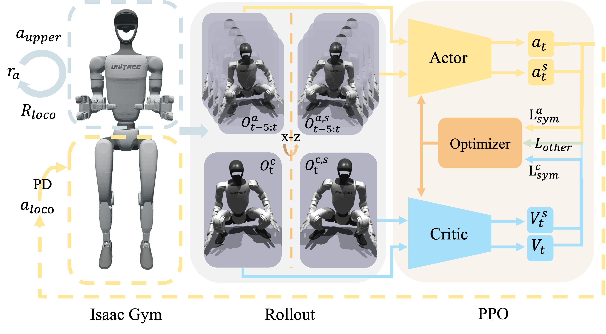

<br>
<p align="center">
<h1 align="center"><strong>HOMIE: Humanoid Loco-Manipulation with Isomorphic Exoskeleton Cockpit (RL)</strong></h1>
  <p align="center">
    <a href='https://www.qingweiben.com' target='_blank'>Qingwei Ben*</a>, <a href='https://trap-1.github.io/' target='_blank'>Feiyu Jia*</a>, <a href='https://scholar.google.com/citations?user=kYrUfMoAAAAJ&hl=zh-CN' target='_blank'>Jia Zeng</a>, <a href='https://jtdong.com/' target='_blank'>Junting Dong</a>, <a href='https://dahua.site/' target='_blank'>Dahua Lin</a>, <a href='https://oceanpang.github.io/' target='_blank'>Jiangmiao Pang</a>
    <br>
    * Equal Controlbution
    <br>
    Shanghai Artificial Intelligence Laboratory & The Chinese University of Hong Kong
    <br>
  </p>
</p>

<div id="top" align="center">

[]()
[]()



</div>

## 📋 Contents

- [🏠 Description](#-description)
- [📚 Installation](#-start)
- [🔗 Citation](#-citation)
- [📄 License](#-license)
- [👏 Acknowledgements](#-acknowledgements)

## 🏠 Description
<a name="-description"></a>
This repository is an official implementation of the reinforcement learning framework proposed by "HOMIE: Humanoid Loco-Manipulation with Isomorphic Exoskeleton Cockpit", which is developed based on [Isaac Gym](https://developer.nvidia.com/isaac-gym) and the codebase of [HIM](https://github.com/OpenRobotLab/HIMLoco). Using this codebase, you can train a Unitree G1 robot to **walk and squat under arbitrary continuous changing upper-body poses**. Our framework is not limited to this kind of humanoid robot but can be used to train other kinds of robots like Fourier GR-1 with just a little modification to the robot config file.

Our framework features three key components:

* **Upper-body Pose Curriculum**: A novel style of curriculum learning that helps humanoid robots to learn to balance under any changing upper-body poses gradually.
* **Height Reward Tracking**: Two key rewards $r_{height}$ and $r_{knee}$ that help humanoid robots learn to squat to the required height precisely and quickly.
* **Symmetry Utilization**: We utilize the symmetry of the humanoid robot to augment the collected data and use $L_{sym}$ as one of the losses used to optimize the networks.

For more details about this framework, please refer to our paper.

## 📚 Getting Started
<a name="-start"></a>
### Prerequisites

We recommend to use our code under the following environment:

- Ubuntu 20.04/22.04 Operating System
- IsaacGym Preview 4.0
  - NVIDIA GPU (RTX 2070 or higher)
  - NVIDIA GPU Driver (recommended version 535.183)
- Conda
  - Python 3.8

### Installation
A. Create a virtual environment and install Isaac Gym:
```
1. conda create -n homierl python=3.8
2. conda activate homierl
3. cd path_to_downloaded_isaac_gym/python
4. pip install -e .
```
B. Install this repository:
```
1. git clone https://github.com/OpenRobotLab/HomieRL.git
2. cd HomieRL && pip install -r requirements.txt
3. cd rsl_rl && pip install -e .
4. cd ../legged_gym && pip install -e .
```
### Train
You can train your own policy with our code by running the command below.
```
python legged_gym/legged_gym/scripts/train.py --task g1 --num_envs 4096 --headless --run_name my_policy --rl_device cuda:0 --sim_device cuda:0
```
The meanings of the parameters in this command are listed below:
* `--task`: the training task
* `--num_envs`: the number of parallel environments used for training
* `--headless`: don't use the visualization window; you cannot use it to visualize the training process
* `--run_name`: name of this training
* `--rl_device` & `--sim_device`: which device is used for training

The default logging method is [wandb](https://wandb.ai/), and you have to set the values of ***run_name***, ***experiment_name***, ***wandb_project***, and ***wandb_user*** to yours in `legged_gym/legged_gym/envs/g1/g1_29dof_config.py`. You can also change the ***logger*** to **tensorboard**. The training results will be saved in `legged_gym/logs/`.

If you encounter the error: ***"ImportError: libpython3.8.so.1.0: cannot open shared object file: No such file or directory"***, you can run this command to solve it, where path_to_miniconda3 is the absolute path of your miniconda directory:
```
export LD_LIBRARY_PATH=path_to_miniconda3/envs/homierl/lib:$LD_LIBRARY_PATH
```
### Play
Once you train a policy, you can first set the [resume_path](https://github.com/OpenRobotLab/HomieRL/blob/main/legged_gym/legged_gym/utils/task_registry.py#L6) to the path of your checkpoint, and run the command below:
```
python legged_gym/legged_gym/scripts/play.py --num_envs 32 --task g1 --resume
```
Then you can view the performance of your trained policy.
### Export Policy
We provide a script for you to export you `.pt` checkpoint to `.onnx`, which can be used by our [deployment code](). You can set the [pt_path]() and [export_path]() to what you need, and run
```
python legged_gym/legged_gym/scripts/export_onnx.py
```

## 🔗 Citation

If you find our work helpful, please cite:

```bibtex
@article{ben2025homie,
  title={HOMIE: Humanoid Loco-Manipulation with Isomorphic Exoskeleton Cockpit},
  author={Ben, Qingwei and Jia, Feiyu and Zeng, Jia and Dong, Junting and Lin, Dahua and Pang, Jiangmiao},
  journal={arXiv preprint arXiv:2502.13013},
  year={2025}
}
```

</details>

## 📄 License

All code of HOMIE is under the <a rel="license" href="http://creativecommons.org/licenses/by-nc-sa/4.0/">Creative Commons Attribution-NonCommercial-ShareAlike 4.0 International License </a><a rel="license" href="http://creativecommons.org/licenses/by-nc-sa/4.0/"></a>. It is strictly forbidden to use it for commercial purposes before asking our team.

## 👏 Acknowledgements


- [RSL_RL](https://github.com/leggedrobotics/rsl_rl): We use `rsl_rl` library to train the control policies for legged robots.
- [Legged_gym](https://github.com/leggedrobotics/rsl_rl): We use `legged_gym` library to train the control policies for legged robots.
- [HIMLoco](https://github.com/OpenRobotLab/HIMLoco): We use `HIMLoco` library as our codebase.