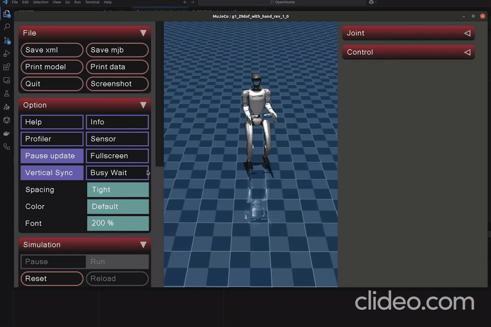
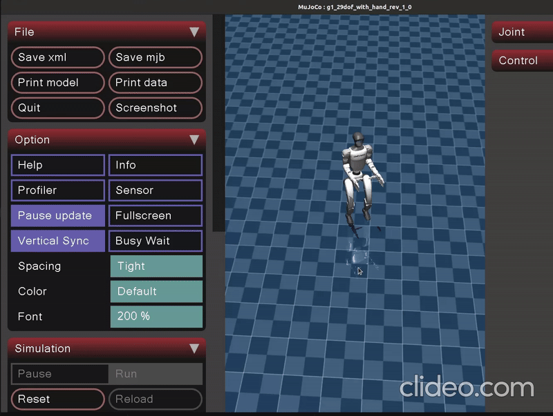

### Sim2Sim (Mujoco)

Run Sim2Sim in the Mujoco simulator:

## Installation

First install MuJoCo:
```bash
pip install mujoco==3.2.3
```

#### Parameter Description
- `config_name`: Configuration file; default search path is `MujocoDeploy/g1.yaml`.

#### Example: Running G1


```bash
cd ~/OpenHomie/MujocoDeploy
python mujoco_deploy_g1.py 
```

#### Replace Network Model

Once you run play.py from the HomieRL, the exported model is located at `{LEGGED_GYM_ROOT_DIR}/logs/exported/policies/policy.pt`. Update the `policy_path` in the YAML configuration file accordingly.

#### Simulation Results

| G1 - Linear x | G1 - Height low | G1 - Angular Yaw |
|--------------|----------------|------------------|
|  |  |  |

## Acknowledgments

This repository is built upon the support and contributions of the following open-source projects:

- [mujoco](https://github.com/google-deepmind/mujoco.git): Providing powerful simulation functionalities.
- [unitree_rl_gym](https://github.com/unitreerobotics/unitree_rl_gym)
---
